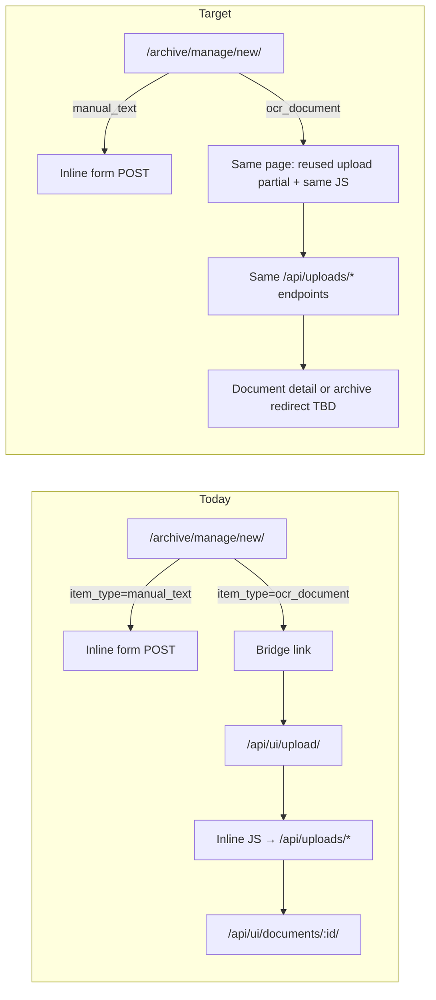

# Unified OCR Upload Flow — Design / Audit

Design and audit note for a future **unified OCR upload experience** inside the archive create-item flow. This document records **current behavior**, **target UX**, **risks**, and a **small-PR implementation plan**. It does **not** change runtime behavior.

**Status:** Design only (audit PR). **Implementation deferred** to follow-up PRs.

**Related docs:**

- `docs/ai-context/decision-log.md` — durable decisions and PR history
- `docs/ai-context/ocr-archiveitem-cutover.md` — OCR shared-field source-of-truth cutover (separate concern)
- `docs/ai-context/archive-discovery-catalog-design.md` — ArchiveItem discovery metadata direction
- `docs/ai-context/multi-image-documents-design.md` — multi-image modeling notes (upload is already implemented)

**Key code references (current behavior):**

- `documents/templates/documents/archive/manage_new.html` — unified create entrypoint; OCR branch bridges to upload page
- `documents/views.py` — `archive_manage_new_page`, `upload_page`, `create_upload`, `upload_complete`, `upload_part_complete`, `upload_finalize`
- `documents/templates/documents/upload.html` — upload form + **inline** presigned-upload JavaScript
- `documents/urls.py` — upload API routes under `/api/`
- `documents/services/archive_items.py` — `create_ocr_document` (creates linked `ArchiveItem` + `Document`)
- `documents/services/upload_validation.py` — MIME/extension validation
- `documents/services/source_files.py` — multi-image helpers and limits (`MULTI_IMAGE_MIN_FILES=2`, `MULTI_IMAGE_MAX_FILES=30`)

---

## 1. Purpose and scope

### Purpose

Staff already start new archive items at **`/archive/manage/new/`**. **Manual text** can be created inline on that page. **OCR documents** (PDF / text image) still redirect staff to the legacy upload page. This note defines how to **integrate OCR upload into the unified create flow** without forking upload behavior, duplicating sensitive S3/JS logic, or touching OCR processing.

### In scope (this design)

- Audit of current OCR upload bridge and endpoints
- Target unified UX direction
- Risks and non-negotiables for future implementation
- Small, reviewable PR sequence
- Manual QA / test checklist for follow-up PRs

### Out of scope (this design PR and the planned UI-integration series)

- Implementing unified OCR upload UI
- Moving or renaming upload routes
- Changing upload JavaScript behavior
- Changing upload API contracts, S3/CORS, presigned URL generation, MIME validation, S3 HeadObject verification, or ContentType checks
- Changing upload completion, multi-image part/finalize semantics, worker, SQS, OCR/HTR routing, Gemini, Transkribus, `DocumentTextResult`, review/status, permissions, or production infra
- **`PHOTO`** item implementation
- Rich text editing
- Unmanaged local JSON files such as `web_task.json` or `worker_task.json`

---

## 2. Current flow (audit)

### 2.1 Unified create entrypoint

| Surface | Route | View | Template |
|---------|-------|------|----------|
| Unified create | `/archive/manage/new/` | `archive_manage_new_page` | `documents/archive/manage_new.html` |

Staff choose item type via GET form (`item_type` query param). Supported slugs (not stored enum values):

| `item_type` slug | Stored `ArchiveItem.item_type` | Create behavior today |
|------------------|--------------------------------|------------------------|
| `manual_text` | `MANUAL_TEXT` | Inline POST form on same page |
| `ocr_document` | `OCR_DOCUMENT` | **Bridge card only** — link to legacy upload page |

When staff select **OCR document**:

1. Page re-renders with `item_type=ocr_document`.
2. Template shows explanatory copy and a primary button **"המשך להעלאת מסמך"**.
3. Button links to **``** → **`/api/ui/upload/`**.
4. No upload form, no presigned JS, and no metadata fields appear on the unified page.

There is also a dedicated manual-text route **`/archive/manage/new/manual-text/`** (legacy alias); OCR has **no** equivalent dedicated create route beyond the unified page bridge.

### 2.2 Legacy upload page (actual OCR upload UI)

| Surface | Route | View | Template |
|---------|-------|------|----------|
| Upload page | `/api/ui/upload/` | `upload_page` | `documents/upload.html` |

- Requires staff/admin (`_require_admin_page`).
- "Back" link goes to **`/api/ui/documents/`** (document list), not `/archive/manage/`.
- After successful upload, JS redirects to **`/api/ui/documents/<document_id>/`**.

Other entrypoints to the same upload page still exist (e.g. document list **"העלאת מסמך חדש"** in `documents/list.html`).

### 2.3 Upload JavaScript location

**There is no separate `.js` file.** All presigned-upload logic lives in an **inline `<script>` block** at the bottom of `documents/upload.html` (approximately lines 164–477).

Functions in that script:

| Function | Role |
|----------|------|
| `getCsrfToken()` | Reads CSRF from `#uploadForm` hidden input, else `csrftoken` cookie |
| `jsonFetch()` | JSON `fetch` wrapper; sets `Content-Type` and **`X-CSRFToken`** |
| `runSingleFileUpload()` | Single PDF/image: create → S3 PUT → complete |
| `runMultiImageUpload()` | Multi-image: create → per-part S3 PUT → part complete → finalize |
| `reportPartFailure()` | Best-effort failed part reporting for multi-image |

Constants duplicated in template JS: `MULTI_IMAGE_MIN_FILES = 2`, `MULTI_IMAGE_MAX_FILES = 30` (server constants live in `documents/services/source_files.py`).

### 2.4 Upload API endpoints

All routes are mounted under **`/api/`** (`vs_archive/urls.py` → `documents.urls`).

| Step | Method | URL | View | Name |
|------|--------|-----|------|------|
| Create (single or multi) | POST | `/api/uploads/create/` | `create_upload` | `uploads-create` |
| Single-file complete | POST | `/api/uploads/<doc_id>/complete/` | `upload_complete` | `uploads-complete` |
| Multi-image part complete | POST | `/api/uploads/<doc_id>/parts/<order_index>/complete/` | `upload_part_complete` | `uploads-part-complete` |
| Multi-image finalize | POST | `/api/uploads/<doc_id>/finalize/` | `upload_finalize` | `uploads-finalize` |

#### Single-file flow (1 PDF or 1 image)

```
Browser                          Backend                         S3
   | POST /api/uploads/create/  -> create_ocr_document + presigned PUT URL
   | PUT presigned URL          ->                               object stored
   | POST .../complete/         -> HeadObject + ContentType check -> enqueue PROCESS_DOCUMENT
```

Create payload includes top-level `doc_type` (`PDF` | `IMAGE`), `original_name`, `mime_type`, `size_bytes`, plus shared metadata (see §2.6).

Complete payload: `{ success: true, file_size, file_mime }`.

#### Multi-image flow (2–30 images, image-only)

```
Browser                          Backend                         S3
   | POST /api/uploads/create/  -> create_ocr_document (expected_source_file_count=N)
   |                               + DocumentSourceFile rows + N presigned URLs
   | for each order_index:
   |   PUT presigned URL        ->                               part stored
   |   POST .../parts/{i}/complete/ -> HeadObject + ContentType check per part
   | POST .../finalize/         -> mirror primary source file -> enqueue PROCESS_DOCUMENT
```

Create payload includes `files[]` (no top-level single-file fields). Each entry: `original_name`, `mime_type`, `size_bytes`. Order is defined by array position (client must not send `order_index`).

Multi-image rejects `POST .../complete/` with 400 ("use part completion and finalize endpoints").

### 2.5 Server-side validation and verification (must remain intact)

| Layer | Location | What it enforces |
|-------|----------|------------------|
| Create — MIME/extension | `upload_validation.py` via `validate_single_file_upload_metadata` / `validate_image_upload_metadata` | Allowed types; extension matches MIME |
| Complete/part — MIME re-check | Same validators on `file_mime` when provided |
| S3 existence + ContentType | `_verify_uploaded_s3_object_metadata` in `views.py` | HeadObject; object exists; ContentType present; matches expected MIME (with alias normalization) |
| CSRF | Django middleware + client `X-CSRFToken` on JSON POSTs | Required on all upload API POSTs |
| Auth | `_require_admin` on upload APIs; `_require_admin_page` on upload page | Staff/admin only |

Failures return explicit HTTP statuses (400 for validation/missing object/mismatch; 502 for S3 HeadObject errors). These behaviors are heavily covered in `documents/tests.py`.

### 2.6 Metadata collected at upload create time

The upload form collects:

| Field | Persisted to | Notes |
|-------|--------------|-------|
| `title`, `visibility`, `date_start`, `date_end`, `date_precision` | `ArchiveItem` (canonical) + `Document` mirror via `create_ocr_document` | Shared archival fields |
| `author_name`, `source_title` | `ArchiveItem` only | Bibliographic metadata |
| `language`, `text_input_type`, `doc_type` | `Document` | OCR/runtime routing inputs |
| `category_event` | `Document.category_event` | **Legacy** OCR-side field |
| `tags` (comma-separated → list) | `Document.tags_m2m` | **Legacy** OCR-side tags |
| `admin_meta` (`donor`, `collection`, `original_location`, `notes`) | `DocumentMetadata` | Staff catalog metadata |

**Gap vs unified manual-text create:** manual text create/edit on `/archive/manage/new/` uses **`ArchiveItem`** discovery metadata (categories / events / tags via `discovery_metadata_form_fields.html` and `update_archive_item_discovery_metadata`). The upload page does **not** collect ArchiveItem discovery metadata today. A future unified OCR create flow should plan to align discovery metadata with manual text **only after** a separate design/implementation decision — not as part of the first UI-integration PR.

### 2.7 ArchiveItem and processing enqueue

`create_ocr_document` (called from `create_upload`):

1. Creates `ArchiveItem` with `item_type=OCR_DOCUMENT` and shared + bibliographic fields.
2. Creates linked `Document` with runtime/upload fields and shared-field mirrors.
3. Attaches legacy tags and `DocumentMetadata` via `_attach_document_tags_and_metadata`.

On successful **single** `upload_complete` or **multi** `upload_finalize`:

- Document upload status → `UPLOADED`
- Processing state → `PROCESSING`
- `send_process_document_message(document_id=...)` enqueues worker processing (unchanged OCR/HTR path)

---

## 3. Future desired UX

### 3.1 Product goal

Staff start at **`/archive/manage/new/`** and choose **"מסמך סרוק / PDF"**. The experience should feel like **one create-item flow** (same chrome, navigation, and metadata patterns as manual text) — **not** a confusing hop to a separate `/api/ui/...` mini-app.

### 3.2 Capabilities that must remain supported

| Capability | Current support | Future unified flow |
|------------|-----------------|---------------------|
| Single image upload | Yes | Must keep |
| PDF upload | Yes | Must keep |
| Multi-image logical document (2–30 images) | Yes | Must keep |
| Title | Yes | Must keep |
| Visibility | Yes | Must keep |
| Date / date_precision | Yes | Must keep |
| author_name / source_title | Yes | Must keep |
| language / text_input_type / doc_type | Yes (OCR-specific) | Must keep on OCR path |
| ArchiveItem discovery metadata | **No** on upload; **Yes** on manual text create | Add when explicitly scoped; align with `archive-discovery-catalog-design.md` |
| Post-create redirect | Document detail `/api/ui/documents/<id>/` | May later offer archive-oriented redirect; **not required for first integration PR** |

### 3.3 UX integration options (non-binding)

Preferred direction: **reuse the existing upload form + inline JS unchanged**, embedded or linked from the unified page shell — not a rewrite.

Possible patterns (choose in implementation PRs):

- **Include** `upload.html` form/script sections as documented partials from a shared template.
- **Same page, same endpoints:** unified page renders file/metadata fields + includes the existing script block verbatim.
- **Progressive disclosure:** item-type selector stays on unified page; OCR branch expands inline rather than navigating away.

Navigation polish (back links to `/archive/manage/`, consistent page titles) belongs in a late PR after behavior parity is proven.

---

## 4. Risks and non-negotiables

| Risk | Mitigation |
|------|------------|
| Duplicate upload JS in two places | Single source of truth: extract/include from `upload.html` (or one static JS asset) — never copy-paste the presigned flow |
| Fork upload API behavior | All flows must call the **same** `/api/uploads/*` endpoints with the **same** payloads |
| Bypass CSRF | Keep `` in form; keep `jsonFetch` / `X-CSRFToken` unchanged |
| Bypass MIME/extension validation | Do not add alternate create paths; server validators stay authoritative |
| Bypass S3 HeadObject / ContentType verification | Do not add "trust client" shortcuts on complete/part/finalize |
| Break multi-image upload | Preserve `files[]` create shape, part loop, terminal failure policy, and finalize gate |
| Touch OCR routing/worker | UI integration PRs must not modify `run_worker.py`, routing, adapters, SQS enqueue semantics, or Transkribus/Gemini |
| Drift between upload metadata and archive create patterns | Track ArchiveItem discovery metadata gap explicitly; do not silently keep legacy `category_event` / `Document.tags_m2m` as the long-term unified create path |

---

## 5. Proposed implementation plan (small PRs)

Adjust sequencing if a PR proves risky; **behavior parity before polish**.

### PR1 — Extract / document reusable upload UI building blocks (no behavior change)

**Goal:** Make the existing upload UI composable without changing what staff see today.

Suggested work:

- Split `documents/upload.html` into clearly named partials (e.g. form fields, admin-meta column, inline script block).
- Keep **`/api/ui/upload/`** rendering the same combined output (include partials).
- Add a short comment in template or this doc pointing to the partials as the **only** upload JS source.
- Tests: existing upload page tests still pass; optional snapshot/assertion that partial includes are wired.

**Do not:** change endpoints, JS logic, or redirect targets.

### PR2 — Integrated shell on unified create page (still same endpoints + JS)

**Goal:** Selecting OCR on `/archive/manage/new/` shows the upload UI **in context** (unified page header/toolbar) while executing the **same** inline script and API calls.

Suggested work:

- Replace the bridge-only card with an include of the upload partials inside `manage_new.html` OCR branch.
- Unified toolbar: "back to manage" instead of/in addition to document-list back link.
- Keep upload POST targets as `/api/uploads/*` (absolute paths as today).

**Do not:** duplicate script; do not embed a second copy of presigned logic.

### PR3 — Embed/move UI only after parity proof

**Goal:** Optional cleanup once PR2 manual QA and automated tests show no regressions.

Possible work:

- Redirect `/api/ui/upload/` to unified create OCR branch **only if** product wants a single URL (would be an explicit product decision + redirect PR).
- Or keep both URLs rendering the same partials indefinitely.

**Do not:** change upload API or S3 behavior.

### PR4 — Copy, navigation, and metadata alignment polish

**Goal:** Product polish and archive-first navigation.

Possible work:

- Hebrew copy consistency with manual text create.
- Post-upload redirect to archive manage or `/archive/<archive_item_id>/` (if desired).
- **Separate sub-effort (may be its own PR):** ArchiveItem discovery metadata on OCR create (categories/events/tags), replacing legacy upload-only `category_event` / `Document.tags_m2m` input — requires explicit scope per `archive-discovery-catalog-design.md`.

### PRs explicitly deferred beyond this series

- OCR shared-field cutover follow-ups (`ocr-archiveitem-cutover.md`)
- Upload API contract changes
- Worker / OCR/HTR changes
- PHOTO create flow

---

## 6. Tests and manual QA (for future implementation PRs)

### Automated (existing coverage to keep green)

`documents/tests.py` already covers much of:

- Upload page access control
- Create/upload complete/part/finalize success and failure paths
- CSRF expectations on JSON POSTs
- MIME mismatch at create and complete
- S3 missing object, missing ContentType, ContentType mismatch (including charset suffix and `image/jpg` alias)
- Multi-image ordering, part failure terminal policy, finalize gating
- `create_ocr_document` / ArchiveItem linkage

Future UI PRs should run targeted upload tests plus `documents/test_archive_item.py` unified create tests.

### Manual QA checklist

| Scenario | Expected |
|----------|----------|
| Single image upload | Document + ArchiveItem created; redirect; processing enqueued |
| PDF upload | Same; `doc_type=PDF` |
| Multi-image upload (2+ images) | All parts complete; finalize enqueues once |
| CSRF failure | API POST rejected when token missing/invalid |
| MIME mismatch (client vs allowed set) | Create or complete returns 400 with explicit error |
| S3 missing object at complete | 400 `s3 object not found`; no enqueue |
| S3 ContentType mismatch | 400 `s3 content type mismatch`; no enqueue |
| date / date_precision persistence | Values on `ArchiveItem` and `Document` mirror after create |
| author_name / source_title persistence | Values on `ArchiveItem` |
| visibility / access | `ArchiveItem.visibility` governs view access |
| ArchiveItem created | `item_type=OCR_DOCUMENT`, linked to `Document` |
| Document processing | SQS job enqueued; worker path unchanged |
| Unified page UX | OCR choice does not require unexplained navigation away from archive manage context |

---

## 7. Current vs target (summary diagram)



---

## 8. Open questions (for product/engineering before PR2+)

1. Should post-upload redirect move from document detail to **`/archive/<archive_item_id>/`**?
2. When should OCR create adopt **ArchiveItem discovery metadata** fields (categories/events/tags) instead of legacy upload `category_event` / `Document.tags_m2m`?
3. Should **`/api/ui/upload/`** remain a supported URL indefinitely (bookmarks, list page button) or redirect to unified create?
4. Should OCR create collect **`metadata_status`** on create (manual text already does)?

These questions do not block this docs-only audit PR, but they should be revisited before UI integration work begins.
