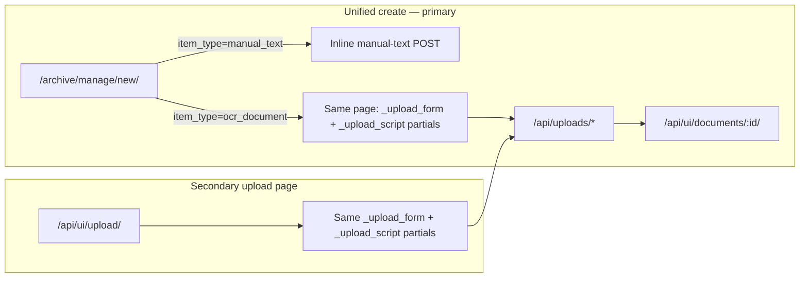

# Unified OCR Upload Flow

Reference note for the **completed** unified OCR upload experience inside the archive create-item flow. This document records **current behavior**, the **PR1–PR3 implementation history**, **risks/non-negotiables**, and **deferred follow-ups**.

**Status:** **Completed** (PR0 design/audit → PR1 partial extraction → PR2 unified embed → PR3 ArchiveItem discovery metadata). Manual QA and focused automated tests passed before PHOTO work.

**Related docs:**

- `docs/ai-context/decision-log.md` — durable decisions and PR history
- `docs/ai-context/ocr-archiveitem-cutover.md` — OCR shared-field source-of-truth cutover (separate concern)
- `docs/ai-context/archive-discovery-catalog-design.md` — ArchiveItem discovery metadata direction
- `docs/ai-context/multi-image-documents-design.md` — multi-image modeling notes

**Key code references (current behavior):**

- `documents/templates/documents/archive/manage_new.html` — unified create entrypoint; OCR branch embeds upload partials inline
- `documents/templates/documents/upload/_upload_form.html` — reusable OCR upload form + admin metadata column
- `documents/templates/documents/upload/_upload_script.html` — **single source of truth** for presigned S3 upload JavaScript
- `documents/templates/documents/upload.html` — `/api/ui/upload/` shell; includes form + script partials
- `documents/views.py` — `archive_manage_new_page`, `_upload_form_context`, `upload_page`, `create_upload`, `upload_complete`, `upload_part_complete`, `upload_finalize`
- `documents/urls.py` — upload API routes under `/api/`
- `documents/services/archive_items.py` — `create_ocr_document`, `update_archive_item_discovery_metadata`
- `documents/services/upload_validation.py` — MIME/extension validation
- `documents/services/source_files.py` — multi-image helpers and limits (`MULTI_IMAGE_MIN_FILES=2`, `MULTI_IMAGE_MAX_FILES=30`)

---

## 1. Purpose and scope

### Purpose

Staff start new archive items at **`/archive/manage/new/`**. **Manual text** is created inline on that page. **OCR documents** (PDF / text image) are now created on the **same unified page** when staff select **מסמך סרוק / PDF** — the upload form and presigned-upload script are embedded inline via shared partials. **`/api/ui/upload/`** remains available as a fallback/secondary upload page using the same partials.

All upload flows call the **same** `/api/uploads/*` endpoints with the **same** client behavior. OCR processing, S3 verification, and worker enqueue semantics were not changed by the UI-integration PRs.

### Completed (PR1–PR3)

- Reusable upload form/script partials extracted from the former monolithic upload page
- OCR upload embedded in `/archive/manage/new/?item_type=ocr_document`
- Shared `_upload_form_context()` for upload page and unified OCR branch
- ArchiveItem discovery metadata (categories / events / discovery_tags) on **new** OCR uploads
- First-party upload UI no longer sends legacy `category_event` or `Document.tags_m2m` tags

### Out of scope (still deferred)

- **`PHOTO`** integration into the unified OCR upload path (PHOTO create exists separately at **`/archive/manage/new/?item_type=photo`** via PHOTO-specific upload API — not **`/api/uploads/*`**)
- Rich text editing
- Legacy schema cleanup (`Document.category_event`, `Document.tags_m2m` removal)
- Backfill of existing OCR documents to ArchiveItem discovery metadata from legacy fields
- Upload API contract changes, S3/CORS changes, worker/OCR/HTR/routing changes
- Unmanaged local JSON files such as `web_task.json` or `worker_task.json`

---

## 2. Current flow

### 2.1 Unified create entrypoint (primary OCR path)

| Surface | Route | View | Template |
|---------|-------|------|----------|
| Unified create | `/archive/manage/new/` | `archive_manage_new_page` | `documents/archive/manage_new.html` |

Staff choose item type via GET form (`item_type` query param). Supported slugs (not stored enum values):

| `item_type` slug | Stored `ArchiveItem.item_type` | Create behavior |
|------------------|--------------------------------|-----------------|
| `manual_text` | `MANUAL_TEXT` | Inline POST form on same page |
| `ocr_document` | `OCR_DOCUMENT` | **Inline upload form + script partials** on same page |

When staff select **OCR document**:

1. Page re-renders with `item_type=ocr_document`.
2. Template shows explanatory copy and includes **`_upload_form.html`** + **`_upload_script.html`**.
3. Upload POST targets remain **`/api/uploads/*`** (absolute paths in the script partial).
4. A secondary link **"פתיחה בדף העלאה נפרד"** points to **`/api/ui/upload/`** for staff who prefer the standalone upload page.
5. Toolbar **"חזרה לניהול"** links back to archive manage (unified chrome).

Manual text also has a dedicated legacy alias route **`/archive/manage/new/manual-text/`**; OCR has no separate dedicated create route beyond the unified page.

### 2.2 Secondary upload page (fallback)

| Surface | Route | View | Template |
|---------|-------|------|----------|
| Upload page | `/api/ui/upload/` | `upload_page` | `documents/upload.html` |

- Requires staff/admin (`_require_admin_page`).
- Renders the **same** `_upload_form.html` and `_upload_script.html` partials as the unified OCR branch.
- "Back" link goes to **`/api/ui/documents/`** (document list), not `/archive/manage/`.
- After successful upload, JS redirects to **`/api/ui/documents/<document_id>/`**.

Other entrypoints to this page still exist (e.g. document list **"העלאת מסמך חדש"** in `documents/list.html`).

### 2.3 Upload UI partials (single source of truth)

Presigned-upload logic is **not** duplicated in `upload.html`. It lives in one template partial:

| Partial | Role |
|---------|------|
| `documents/upload/_upload_form.html` | File input, shared/bibliographic metadata, OCR fields, discovery metadata fields, admin-meta column |
| `documents/upload/_upload_script.html` | Presigned S3 upload JavaScript — include **once** per page hosting `#uploadForm` |

Functions in the script partial:

| Function | Role |
|----------|------|
| `getCsrfToken()` | Reads CSRF from `#uploadForm` hidden input, else `csrftoken` cookie |
| `jsonFetch()` | JSON `fetch` wrapper; sets `Content-Type` and **`X-CSRFToken`** |
| `runSingleFileUpload()` | Single PDF/image: create → S3 PUT → complete |
| `runMultiImageUpload()` | Multi-image: create → per-part S3 PUT → part complete → finalize |
| `reportPartFailure()` | Best-effort failed part reporting for multi-image |

Constants in template JS: `MULTI_IMAGE_MIN_FILES = 2`, `MULTI_IMAGE_MAX_FILES = 30` (server constants live in `documents/services/source_files.py`).

`views._upload_form_context()` supplies shared template context (doc type choices, date precision choices, empty discovery form data, `discovery_tags` input id/name) to both `upload_page` and the unified OCR branch.

### 2.4 Upload API endpoints

All routes are mounted under **`/api/`** (`vs_archive/urls.py` → `documents.urls`).

| Step | Method | URL | View | Name |
|------|--------|-----|------|------|
| Create (single or multi) | POST | `/api/uploads/create/` | `create_upload` | `uploads-create` |
| Single-file complete | POST | `/api/uploads/<doc_id>/complete/` | `upload_complete` | `uploads-complete` |
| Multi-image part complete | POST | `/api/uploads/<doc_id>/parts/<order_index>/complete/` | `upload_part_complete` | `uploads-part-complete` |
| Multi-image finalize | POST | `/api/uploads/<doc_id>/finalize/` | `upload_finalize` | `uploads-finalize` |

#### Single-file flow (1 PDF or 1 image)

```
Browser                          Backend                         S3
   | POST /api/uploads/create/  -> create_ocr_document + presigned PUT URL
   |                               + ArchiveItem discovery metadata (if provided)
   | PUT presigned URL          ->                               object stored
   | POST .../complete/         -> HeadObject + ContentType check -> enqueue PROCESS_DOCUMENT
```

Create payload includes top-level `doc_type` (`PDF` | `IMAGE`), `original_name`, `mime_type`, `size_bytes`, plus shared metadata (see §2.6).

Complete payload: `{ success: true, file_size, file_mime }`.

#### Multi-image flow (2–30 images, image-only)

```
Browser                          Backend                         S3
   | POST /api/uploads/create/  -> create_ocr_document (expected_source_file_count=N)
   |                               + DocumentSourceFile rows + N presigned URLs
   |                               + ArchiveItem discovery metadata (if provided)
   | for each order_index:
   |   PUT presigned URL        ->                               part stored
   |   POST .../parts/{i}/complete/ -> HeadObject + ContentType check per part
   | POST .../finalize/         -> mirror primary source file -> enqueue PROCESS_DOCUMENT
```

Create payload includes `files[]` (no top-level single-file fields). Each entry: `original_name`, `mime_type`, `size_bytes`. Order is defined by array position (client must not send `order_index`).

Multi-image rejects `POST .../complete/` with 400 ("use part completion and finalize endpoints").

### 2.5 Server-side validation and verification

| Layer | Location | What it enforces |
|-------|----------|------------------|
| Create — MIME/extension | `upload_validation.py` via `validate_single_file_upload_metadata` / `validate_image_upload_metadata` | Allowed types; extension matches MIME |
| Complete/part — MIME re-check | Same validators on `file_mime` when provided |
| S3 existence + ContentType | `_verify_uploaded_s3_object_metadata` in `views.py` | HeadObject; object exists; ContentType present; matches expected MIME (with alias normalization) |
| CSRF | Django middleware + client `X-CSRFToken` on JSON POSTs | Required on all upload API POSTs |
| Auth | `_require_admin` on upload APIs; `_require_admin_page` on upload page | Staff/admin only |

Failures return explicit HTTP statuses (400 for validation/missing object/mismatch; 502 for S3 HeadObject errors). Covered in `documents/tests.py` (`UploadApiTests`) and template tests (`UploadPageTemplateTests`, `UnifiedArchiveItemCreatePageTests`).

### 2.6 Metadata collected at upload create time

The first-party upload form collects:

| Field | Persisted to | Notes |
|-------|--------------|-------|
| `title`, `visibility`, `date_start`, `date_end`, `date_precision` | `ArchiveItem` (canonical) + `Document` mirror via `create_ocr_document` | Shared archival fields |
| `author_name`, `source_title` | `ArchiveItem` only | Bibliographic metadata |
| `language`, `text_input_type`, `doc_type` | `Document` | OCR/runtime routing inputs |
| `categories` (list or comma-separated string) | `ArchiveItem.categories` | Via `update_archive_item_discovery_metadata` |
| `events` (list or comma-separated string) | `ArchiveItem.events` | Same service |
| `discovery_tags` (list or comma-separated string) | `ArchiveItem.tags` | Same service; UI field id/name is `discovery_tags` |
| `admin_meta` (`donor`, `collection`, `original_location`, `notes`) | `DocumentMetadata` | Staff catalog metadata |

**Legacy fields (schema still exists; first-party upload no longer sends them):**

| Field | Schema | Current upload behavior |
|-------|--------|-------------------------|
| `category_event` | `Document.category_event` | **Not** set by `create_upload` for new first-party uploads. Legacy JSON in create payload is tolerated/ignored. |
| `tags` | `Document.tags_m2m` | **Not** set by `create_upload` for new first-party uploads. Legacy JSON in create payload is tolerated/ignored. |

**Forward-only:** No backfill, no migration, and no modification of existing documents were part of PR3. Older OCR documents may still have legacy `Document.category_event` / `Document.tags_m2m` values from prior uploads or edit flows.

Discovery metadata on the upload form uses the same shared partial as manual text create: `documents/archive/discovery_metadata_form_fields.html`.

### 2.7 ArchiveItem and processing enqueue

`create_ocr_document` (called from `create_upload`):

1. Creates `ArchiveItem` with `item_type=OCR_DOCUMENT` and shared + bibliographic fields.
2. Creates linked `Document` with runtime/upload fields and shared-field mirrors.
3. Attaches `DocumentMetadata` from `admin_meta` when provided.
4. Applies ArchiveItem discovery metadata via `_apply_upload_discovery_metadata` → `update_archive_item_discovery_metadata` when categories/events/discovery_tags are present in the create payload.

On successful **single** `upload_complete` or **multi** `upload_finalize`:

- Document upload status → `UPLOADED`.
- Initial completion sets processing state to `PROCESSING`.
- After the upload transaction, `enqueue_uploaded_document_processing(...)` creates, retries, or coalesces a durable `ProcessDocumentRequest` with `operation=OCR`, `origin=UPLOAD_FINALIZE`, and `ocr_retry_mode=normal_reenqueue`.
- SQS receives the Request-aware `request_id` payload rather than the legacy upload `document_id` payload.
- Repeated completion still consults the durable Request. Active work coalesces; matching terminal upload history is an idempotent no-op; worker-owned state is not overwritten.
- Expected enqueue failures return safe typed API errors without raw queue details.

Intentional OCR reprocess is a separate durable caller path. It preserves the
existing route-aware eligibility assessment, creates or coalesces a
`ProcessDocumentRequest` with `origin=OCR_REPROCESS`, and stores a source
Transkribus run only for recognition-only resume. Its Document-state updates
are fenced by the current Request status so they cannot overwrite worker-owned
running or terminal state.

Intentional Hebrew-translation retry is also a durable caller path. It creates
or coalesces a `ProcessDocumentRequest` with
`operation=HEBREW_TRANSLATION`, `origin=HEBREW_TRANSLATION_RETRY`, no OCR retry
mode, and no source Transkribus run. Enqueue leaves Document processing state
unchanged; the translation worker owns claim and completion. Expected queue,
conflict, and recovery failures use safe typed feedback.

---

## 3. Implementation history (PR1–PR3)

### PR1 — Extract reusable upload UI partials ✅ **Completed**

- Split former monolithic `documents/upload.html` into `_upload_form.html` and `_upload_script.html`.
- `/api/ui/upload/` shell unchanged in behavior; now includes partials.
- No endpoint, JS logic, or redirect changes.

### PR2 — Embed OCR upload in unified create page ✅ **Completed**

- Replaced bridge-only OCR card with inline includes of upload partials in `manage_new.html`.
- Added shared `views._upload_form_context()`.
- Unified page toolbar uses archive-manage navigation; secondary link to `/api/ui/upload/` retained.
- Same `/api/uploads/*` endpoints and script partial; no duplicate presigned logic.

### PR3 — ArchiveItem discovery metadata on OCR create ✅ **Completed**

- First-party upload UI uses `categories`, `events`, `discovery_tags` (shared discovery form partial).
- Upload JS sends those fields in create-upload JSON; `create_upload` parses and persists to linked `ArchiveItem`.
- Legacy `category_event` / `tags` removed from first-party upload UI; legacy JSON tolerated but not written to `Document`.
- Forward-only: no backfill, no migrations, no schema cleanup, no existing document changes.

---

## 4. Risks and non-negotiables (still apply)

| Risk | Mitigation (implemented) |
|------|--------------------------|
| Duplicate upload JS in two places | Single partial: `_upload_script.html` — included, never copy-pasted |
| Fork upload API behavior | All surfaces call the same `/api/uploads/*` endpoints |
| Bypass CSRF | `` in form; `jsonFetch` / `X-CSRFToken` unchanged |
| Bypass MIME/extension validation | Server validators remain authoritative on create and complete/part |
| Bypass S3 HeadObject / ContentType verification | No client-trust shortcuts on complete/part/finalize |
| Break multi-image upload | `files[]` create shape, part loop, terminal failure policy, finalize gate preserved |
| Touch OCR routing/worker in UI PRs | PR1–PR3 did not modify worker, routing, adapters, or SQS semantics |
| Drift between upload and manual-text discovery patterns | PR3 aligned new OCR uploads to ArchiveItem discovery metadata |

---

## 5. Tests and QA

### Automated coverage (green after PR1–PR3)

Focused suites:

- `documents.tests.UploadPageTemplateTests` — upload page partial wiring, discovery fields, legacy field absence, JS endpoints
- `documents.tests.UploadApiTests` — create/complete/part/finalize, MIME/S3, multi-image, discovery persistence, legacy field non-persistence
- `documents.test_archive_item.UnifiedArchiveItemCreatePageTests` — unified OCR branch renders same partials and discovery fields

### Manual QA checklist (passed before PHOTO)

| Scenario | Expected |
|----------|----------|
| Single image upload | Document + ArchiveItem created; redirect; processing enqueued |
| PDF upload | Same; `doc_type=PDF` |
| Multi-image upload (2+ images) | All parts complete; finalize enqueues once |
| Discovery metadata on create | categories/events/discovery_tags on `ArchiveItem`; not on legacy Document fields |
| Unified page UX | OCR choice shows inline upload without required navigation away |
| Fallback upload page | `/api/ui/upload/` works with same form/script behavior |

---

## 6. Current flow (diagram)



---

## 7. Deferred / open items

These are **not** blockers for PHOTO work:

1. **Post-upload redirect** — still goes to **`/api/ui/documents/<document_id>/`**. Archive-item detail redirect (`/archive/<archive_item_id>/`) is a future product decision.
2. **`/api/ui/upload/` longevity** — page remains supported (bookmarks, document list button, unified-page secondary link). Retirement or redirect to unified create is an explicit future product decision.
3. **Upload page back link** — fallback page still links to document list, not archive manage.
4. **`metadata_status` on OCR create** — manual text create collects it; OCR upload create does not (deferred).
5. **Legacy schema cleanup** — `Document.category_event` and `Document.tags_m2m` remain for old/transitional data; no backfill from legacy fields to ArchiveItem discovery metadata in this series.
6. **`PHOTO`** OCR-pipeline integration — not applicable. PHOTO create/upload is implemented separately at **`/archive/manage/new/?item_type=photo`** via **`/api/photo-uploads/*`** (not **`/api/uploads/*`**).
7. **Rich text** — not implemented.
8. OCR shared-field cutover follow-ups (`ocr-archiveitem-cutover.md`) — separate concern.
